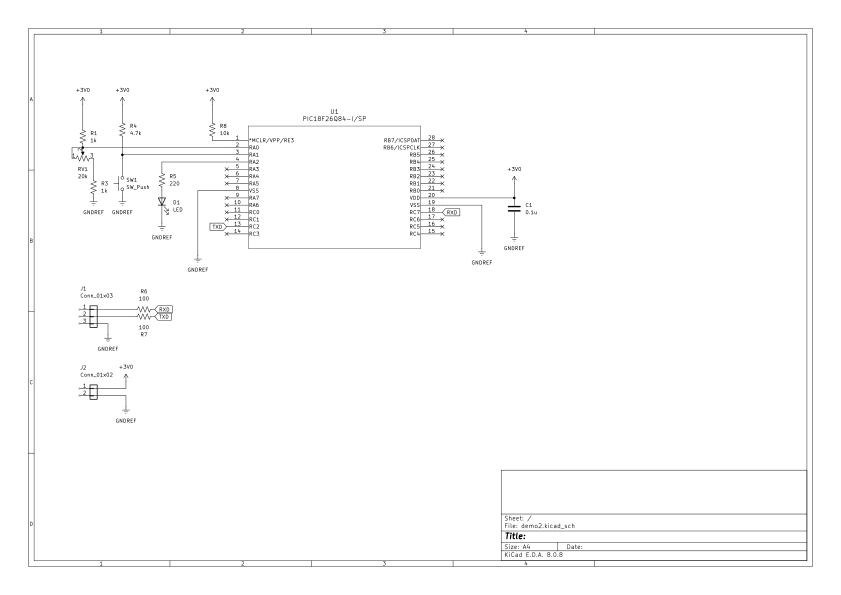
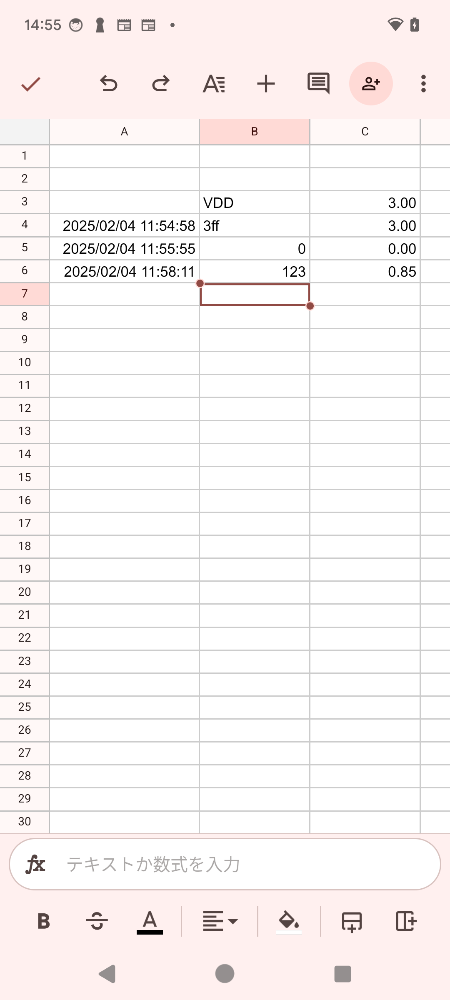

# IMBLE3h インターフェーステストモジュール
:toc:
:toc-levels: 3
:toc-title: 目次
:nofooter:
:sectnums:
:abstract-caption: 概要
:figure-caption: 図
:table-caption: 表
:source-highlighter: highlightjs
:highlightjsdir: https://cdnjs.cloudflare.com/ajax/libs/highlight.js/11.9.0/

<<<

## 概要

link:https://www.interplan.co.jp/solution/wireless/imble/imble3_family.php[IMBLE3h]の +
デモを行うモジュール及びスマホのデモ方法


### 外観

image:images/imble3h_app.png[width="300"]

<<<

### 回路図



### 動作概要

- PIC(PIC12F683)はGPIO#2がアナログ入力となっています
- 可変抵抗の大きさによって0.15V〜1.5Vまでの値を電源電圧との比で検出します
- ボタンを押すとアナログ入力を測定し、測定値をRAWデータでIMBLE3hへUART経由で送信します
- 送信内容は 大体(*1) `TXDA\r\n00F\n\0`〜 `TXDA\r\n200\n\0` となります

(*1) 電圧検出に若干のブレが発生する場合があるため

<<<

## スマホ

### 概要

- スマホはIMBLE3hをBluetoothキーボードとして認識します

- スマホはインターネットに接続されている必要があります

- 本デモ手順での説明には、 +
スマホに `google spreadsheet` アプリがインストール済みであることを想定しています

- Bluetoothキーボードからの入力を受けてキーボードの内容から +
電圧に変換し、表示します

### 事前準備

- IMBLE3h-ADPとUSBインターフェイスボードを接続します
- USBインターフェイスボードとPCをUSBケーブルで接続します
- テラタームなどのターミナルエミュレータで接続します(*1)
- `RPRM` + Enterを実行します
デバイス名が `IMBLE3h-0000100` であることと、 `ENRX` が表示されていることを確認してください
- デバイス名が変更されている場合はメモしてください
- `ENRX` が表示されていない場合、`ENWR` と `ENRX`、`SRST` を順に入力し、再度`RPRM`を実行して `ENRX` が表示されることを確認してください
- それでも `ENRX` が表示されない場合はデバイス不良の可能性があります
- 問題なければ接続を外してください

(*1) +
ボーレート57600, 8bit, no-parity, stop:1bit, no-flow-control +
送信改行コード(CR + LF)

### デモ手順

1. スマホがインターネットに接続されていることを確認してください
2. スマホに `google spreadsheet` (*1)をインストールしてください 
3. 念の為、自動ロックを解除してください(*2)
4. Bluetoothで `IMBLE3h-0000100` とペアリングしてください(*3)
5. `google spreadsheet` から link:https://docs.google.com/spreadsheets/d/1jFiBgtA3LblUtUAtXk8owhEB7B_3-Ibso25Myq1gFpY/edit?usp=sharing[imble3hデモアプリ]を開いてください
6. B列のB4セル以降のどこか上の方を選択してください
7. テストモジュールを接続し、電池を入れてください
8. ボタンを押して離すと、キーコード(*4)が送信されます。
9. 入力されたRAW値をもとに埋め込み関数が電圧に変換してC列に表示します
10. B列が変化するとマクロがA列に現在日時を自動入力します


(*1) +
- link:https://play.google.com/store/apps/details?id=com.google.android.apps.docs.editors.sheets&hl=ja&pli=1[Android] +
- link:https://apps.apple.com/jp/app/google-%E3%82%B9%E3%83%97%E3%83%AC%E3%83%83%E3%83%89%E3%82%B7%E3%83%BC%E3%83%88/id842849113[iPhone]


(*2) +
デモ中に画面が暗くならないための設定です。

 - Androidの場合、解除出来ないので30分などにしてください。 +
設定 -> ディスプレイ -> 画面消灯 -> 30分 +
 - iPhoneの場合、設定 -> 画面表示を明るさ -> 自動ロック -> なし

(*3) +
ペアリングの方法はお使いのスマホのマニュアルをご参照ください +
デバイス名が変更されていた場合はメモしたデバイス名のものに接続してください

(*4) +
例えば"   123\n"などです。

<<<

### 表示サンプル




<<<

### その他

.C列(C4)の関数は以下
```
=if (len(B4)>0,(HEX2DEC(B4)/hex2dec("3ff")) * $C$3, "")
```

.マクロの内容は以下
```javascript
function onEdit(e) {
  const range = e.range;
  if (range.getColumn() == 2) {
    var sheet = e.source.getActiveSheet();
    var row = range.getRow();
    sheet.getRange(row, 1).setValue(new Date());
  }  
}
```

<<<

.PICのコードは以下(*1)
```c
#pragma config FOSC = INTOSCIO // Oscillator Selection bits (INTOSCIO oscillator: I/O function on RA4/OSC2/CLKOUT pin, I/O function on RA5/OSC1/CLKIN)
#pragma config WDTE = OFF      // Watchdog Timer Enable bit (WDT disabled)
#pragma config PWRTE = OFF     // Power-up Timer Enable bit (PWRT disabled)
#pragma config MCLRE = OFF     // MCLR Pin Function Select bit (MCLR pin function is digital input, MCLR internally tied to VDD)
#pragma config CP = OFF        // Code Protection bit (Program memory code protection is disabled)
#pragma config CPD = OFF       // Data Code Protection bit (Data memory code protection is disabled)
#pragma config BOREN = OFF     // Brown Out Detect (BOR disabled)
#pragma config IESO = OFF      // Internal External Switchover bit (Internal External Switchover mode is disabled)
#pragma config FCMEN = OFF     // Fail-Safe Clock Monitor Enabled bit (Fail-Safe Clock Monitor is disabled)


#define _XTAL_FREQ 8000000

#define BIT_WAIT_50us 0x64
#define BIT_WAIT_100us 0xa0
#define REG_SLEEP 0x50
#define HIGH_NIBBLE 1
#define LOW_NIBBLE 0

int i, j;
char button, temp, temp2, cnt, vh, vl, vc;
static void led_on(void);
static void led_off(void);
static void UART_init(void);
static void UART_write(char);
static void UART_send(const char *s);
static void read_analog(void);
static void usleep(void);
static char get_button_state(void);
static char b2c(char, int);
```

```c
void main()
{
     OSCCON = 0x70;
     TRISIO = 0x34; // input: GP2,GP4,GP5 output:GP0,GP1
     ANSEL = 4;     // GP2 analog
     ADCON0 = 0x85; // Right justified, AN2, ADON
     WPU = 0x30;
     T2CON = 0x4; // f/1, TMR2m on
     CMCON0 = 7;  // AN2
     led_off();
     UART_init();

     button = 1;
     while (1)
     {
          temp = get_button_state();
          if (button == temp)
               continue;
          button = temp;

          if (!button)
          {
               read_analog();

               // UART_send("TXDA\r\n   123\n\0");
               UART_write('T');
               UART_write('X');
               UART_write('D');
               UART_write('A');
               UART_write('\r');
               UART_write('\n');
               UART_write(' ');
               UART_write(' ');
               UART_write(' ');

               vc = b2c(vh, LOW_NIBBLE);
               UART_write(vc);

               vc = b2c(vl, HIGH_NIBBLE);
               UART_write(vc);

               vc = b2c(vl, LOW_NIBBLE);
               UART_write(vc);

               UART_write('\n');
               UART_write('\0');

               __asm BCF 3, 5;
               __asm MOVLW BIT_WAIT_100us;
               __asm MOVWF REG_SLEEP;
               usleep();

          }
     }
}

static void led_on()
{
     GPIO.B0 = 1;
}
static void led_off()
{
     GPIO.B0 = 0;
}

static void UART_init()
{
     GPIO.B1 = 1;
}

static void UART_send(const char *s)
{
     for (i = 0; s[i]; i++)
     {
          UART_write(s[i]);
     }
}

static void usleep(void)
{
     __asm BCF 3, 5;
     __asm MOVF REG_SLEEP;
     __asm BSF 3, 5;
     __asm MOVWF PR2;
     __asm BCF 3, 5;
     __asm CLRF TMR2;
     __asm BSF T2CON, 2;
     __asm sleep_loop: ;
     __asm MOVF TMR2;
     __asm SUBWF REG_SLEEP, 0;
     __asm BTFSC STATUS, 1;
     __asm GOTO sleep_loop;
}

static void UART_write(char send_char)
{
     GPIO.B1 = 0;
     __asm BCF 3, 5;
     __asm MOVLW BIT_WAIT_50us;
     __asm MOVWF REG_SLEEP;

     usleep();
     for (j = 0; j < 8; j++)
     {
          if (send_char & (1 << j))
          {
               GPIO.B1 = 1;
          }
          else
          {
               GPIO.B1 = 0;
          }
          __asm BCF 3, 5;
          __asm MOVLW BIT_WAIT_50us;
          __asm MOVWF REG_SLEEP;

          usleep();
     }
     GPIO.B1 = 1;
     __asm BCF 3, 5;
     __asm MOVLW BIT_WAIT_100us;
     __asm MOVWF REG_SLEEP;
     usleep();
}

static void read_analog()
{
     __asm BCF 3, 5; // bank 0
     __asm MOVLW 0x87;
     __asm MOVWF ADCON0; // Right justified, AN2, ADON, GO
     __asm analog_loop: ;
     __asm BTFSC ADCON0, 1;
     __asm GOTO analog_loop;

     vh = ADRESH;
     vl = ADRESL;
}

static char get_button_state(void)
{
     cnt = 0;
     temp = GPIO.B5;

     TMR2 = 0;
     PR2 = 0x60;
     T2CON.B2 = 1;
     while (TMR2 < 0x60)
     {
          temp2 = GPIO.B5;
          if (!temp2)
          {
               cnt++;
          }
     }

     if (cnt > 10)
     {
          temp = 0;
          led_on();
     }
     else
     {
          temp = 1;
          led_off();
     }
     T2CON.B2 = 0;
     while (!GPIO.B5)
          ;

     return temp;
}

static char b2c(char b, int d)
{

     if (d)
     {
          temp2 = (b & 0xF0) >> 4;
     }
     else
     {
          temp2 = (b & 0xF);
     }

     if (temp2 < 0xa)
     {
          temp2 += '0';
     }
     else
     {
          temp2 = temp2 - 0xa + 'A';
     }
     return temp2;
}
```

(*1)
コンパイラは link:https://www.mikroe.com/[MikroElektronika] の link:https://www.mikroe.com/mikroc-pic[mikroC PRO for PIC] を使用